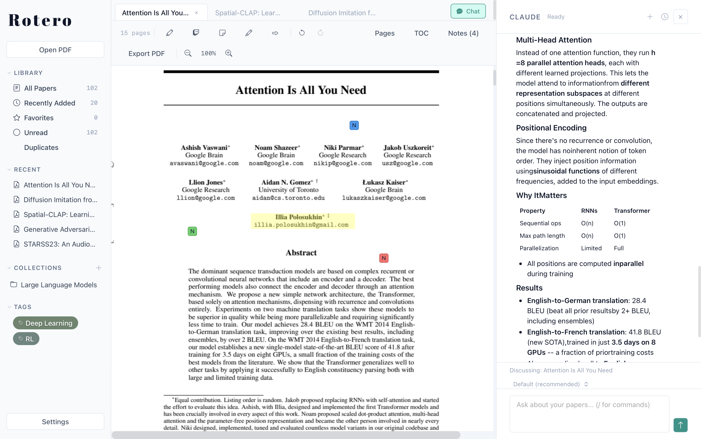

# Rotero

<p align="center">
  
</p>

<p align="center">
  <a href="https://pohsuanlai.github.io/rotero"></a>
  <a href="https://github.com/PoHsuanLai/rotero/actions/workflows/ci.yml"></a>
  <a href="https://github.com/PoHsuanLai/rotero/releases/latest"></a>
  <a href="https://github.com/PoHsuanLai/rotero/blob/master/LICENSE"></a>
  
  
  
</p>

A fast, private, local-first reference manager built with Rust. Read, annotate, cite, and explore your papers — without the bloat.

<p align="center">
  
</p>

## Why Rotero
- **Zotero web translators compatible** — One-click import from Google Scholar, arXiv, PubMed, and 40+ academic sites
- **Citation graph** — Interactive visualization of how your papers connect
- **AI research assistant** — Chat with your papers via ACP — use your Claude subscription, no API costs
- **CRR sync** — Custom conflict-free replicated relations for multi-device sync
- **Local-first** — SQLite database, no accounts, no telemetry, no cloud dependency

## Performance

Memory with 5 PDF tabs open (avg of 5 runs, macOS):

| | Rotero | Zotero 7 |
|---|---|---|
| Memory | ~220 MB | ~1.4 GB |

## Status

Under active development. Known limitations:

- PDF virtual text layer (selection/copy) needs refinement
- Mobile app (iOS/Android) planned, not yet available

## Install

Download the latest release from the [Releases page](https://github.com/PoHsuanLai/rotero/releases/latest).

> **macOS note:** On first launch, macOS may show "Apple could not verify “Rotero” is free of malware that may harm your Mac or compromise your privacy." This is because the app is not notarized with an Apple Developer account. To open it: go to System Settings → Privacy & Security → scroll down to "Rotero was blocked to protect your Mac." -> click "Open Anyway". You only need to do this once.

### Build from source

Requires [Rust](https://rustup.rs/) and [just](https://github.com/casey/just).

```sh
git clone https://github.com/PoHsuanLai/rotero.git
cd rotero
just run    # downloads PDFium, builds, runs
```

Other commands: `just check`, `just lint`, `just build-release`, `just run-release`, `just clean`

## Browser Extension

Download `Rotero-Extension.zip` from the [Releases page](https://github.com/PoHsuanLai/rotero/releases/latest), unzip it, then:

1. Go to `chrome://extensions/` → enable **Developer mode** (top right)
2. Click **Load unpacked** → select the unzipped folder
3. Keep Rotero running (the extension connects to `localhost:21984`)

> **Why Developer mode?** The extension is not on the Chrome Web Store, which requires a paid developer account. Loading unpacked is the standard way to install extensions distributed outside the store.

## Word Add-in

Insert and manage citations directly in Microsoft Word.

1. Make sure Rotero is running
2. Copy the manifest to Word's sideload directory:
   ```sh
   mkdir -p ~/Library/Containers/com.microsoft.Word/Data/Documents/wef
   cp word-addin/manifest.xml ~/Library/Containers/com.microsoft.Word/Data/Documents/wef/
   ```
3. Restart Word — a **Rotero** group appears in the **Home** tab

Features:
- **Insert Citation** — search your library and insert inline citations (e.g. "(Smith, 2024)")
- **Bibliography** — generate a bibliography from all cited papers in the document
- **Refresh** — update all citations and bibliography to a different CSL style

Citations are stored as Word content controls with metadata, so they survive editing and can be refreshed at any time. Supports 14 CSL styles (APA, Chicago, MLA, Vancouver, IEEE, etc.).

> The add-in taskpane is served locally from the Rotero connector (`localhost:21984`). All data stays on your machine.

## Architecture

Cargo workspace with 9 crates:

| Crate | Purpose | Key deps |
|---|---|---|
| `rotero-models` | Shared data types | serde |
| `rotero-db` | SQLite CRUD | turso |
| `rotero-pdf` | PDF rendering + annotation writing | pdfium-render, lopdf |
| `rotero-bib` | BibTeX/RIS/CSL + citation generation | biblatex, hayagriva |
| `rotero-connector` | Browser extension + Word add-in HTTP server | axum |
| `rotero-translate` | Zotero translation server (Node.js sidecar) | reqwest |
| `rotero-graph` | Citation graph visualization | fdg |
| `rotero-mcp` | MCP server for AI integration | rmcp |
| `rotero` (app) | Desktop UI, state management | dioxus, reqwest |

## Data Storage

Local SQLite database. PDFs copied to a managed directory.

| Platform | Location |
|---|---|
| macOS | `~/Library/Application Support/com.rotero.Rotero/` |
| Linux | `~/.local/share/rotero/` |

## License

AGPL-3.0-or-later
